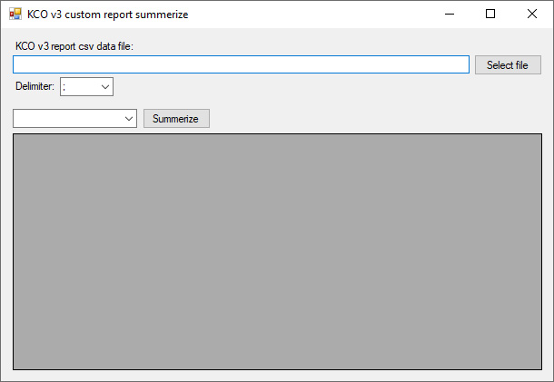

# cs-kco-v3-csv-report-sum
Simple c# program to summerize custom reports from Klarna checkout v3.

Sums FEE, SALE and RETURN in a datagridview. 

Dummy data included to try it out. The program is only checking this columns (in dummy data) and ignores rest in a real exported report.

# How to use
- Export custom report from KCO
- Select exported file
- Select currency
- Click on summerize

## Screenshot

